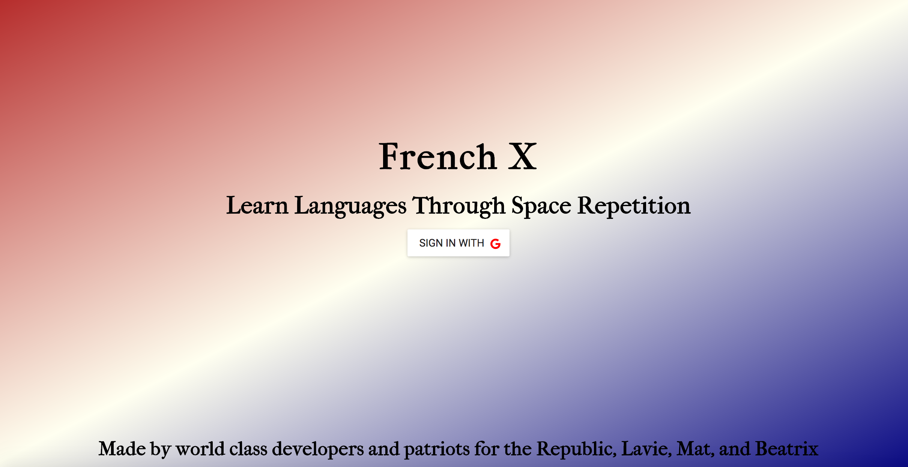
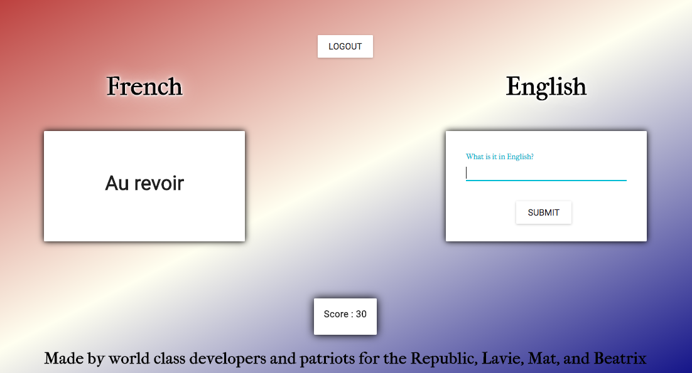

# French X

An application that will aid you in learning the French language developed by Mat, Lavie, and Beatrix

Live Demo: https://french-x.herokuapp.com/

## A little bit about French X

French X was developed to help students who are learning french. We used the spaced repetition algorithm to ensure the most suitable learning environment for everyone. The algorithm is fairly simple: if the user answers the question correctly, that question will move back 2 spaces concurrently in the list. If the user answers the question incorrectly, that question will move back only 1 space in the list. In layman's terms, questions answered incorrectly will show up more often than questions answered correctly.

## How to use this app

* Registering for French X is easy. Simply click `sign in with google`, enter your gmail log in credentials, and wam bam, you're learning French.
* Once you're logged in, you must translate what the French vocabulary word is to English.
* When you have your French word translated, type your answer in the `English` input field (I'm sure you got it right. You're a smart little cookie.)
* If you answered the question correctly, congratulations! Your score will increase by 10 and you'll feel good about yourself.
* If you answered the question incorrectly, that's okay! The algorithm will set that question to come up again really soon so you may try again.
* Once you've mastered the French language, press the logout button to successfully sign out of French X.

## API Documentation

* /auth/google: used to log into the application using the google oauth system
* /questions/`accessToken`: GET the questions returning information that specifically pertains to the user tied to that access token
* /questions/`accessToken`: POST the weight of each question to the database as the user correctly or incorrectly answers the question

## Technical

The frontend of this web application is developed using React and Redux. The backend uses Node.js and Mongo to store information the database. French X uses the Google OAuth 2.0 system. This is used to easily log users in using their gmail credentials and store their session in the database. There are 10 total questions stored in the database. Each question has a weight attached to them that decides how many places in the array it will be sent back. For example if a question has a weight of 4, that question will be sent back 4 places. As you answer the next 4 questions, you will see that same question again.

# Go forth and learn!